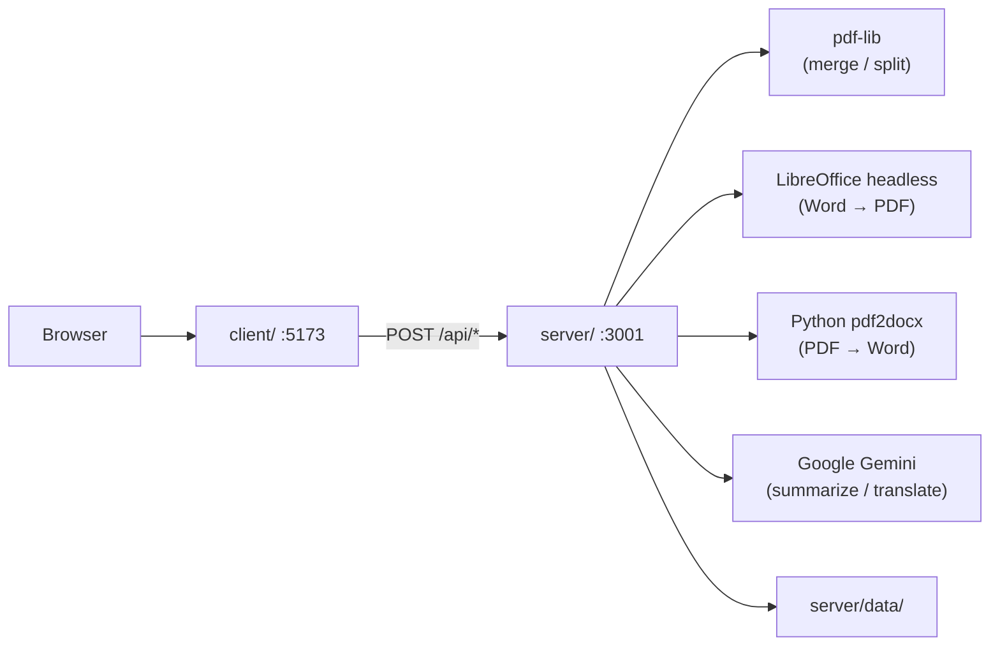

# legalHub — PDF Converter

A self-hosted document processing toolkit for legal professionals. Convert, merge, split, summarize, and translate PDFs with sensitive files staying on your own infrastructure.

---

## What it solves

Legal teams often rely on online tools that upload sensitive documents (contracts, briefs, case files) to external servers. **legalHub** processes files on the client's own infrastructure: uploads, conversions, and storage follow the organization's security policies.

AI features (summarize and translate) send **extracted text only** to Google Gemini — never the raw PDF file.

---

## Features

| Tool | App route | Description |
|---|---|---|
| **Login** | `/` | Landing page with demo access (client-side only) |
| **Tools hub** | `/herramienta` | Main dashboard with all available tools |
| **Merge PDF** | `/unir-pdf` | Combines multiple PDFs into one, preserving user-defined order |
| **Split PDF** | `/separar-pdf` | Splits a PDF into individual pages or by ranges (e.g. `1-3, 5, 7-9`) |
| **PDF to Word** | `/pdf-a-word` | Converts PDF to editable `.docx` via Python pdf2docx |
| **Word to PDF** | `/word-a-pdf` | Converts `.docx` to PDF via LibreOffice |
| **Summarize PDF** | `/resumir-pdf` | AI summary of PDF text → downloadable structured PDF (Gemini) |
| **Translate PDF** | `/traducir-pdf` | AI translation to a target language → downloadable PDF (Gemini) |
| **History** | `/historial` | List of operations performed on the server |
| **Report issue** | `/reportar-problema` | Submit bug reports with screenshots to the administrator |

Generated files and operation history are stored under `server/data/`.

### Demo login

The app opens on `/` with a login screen. Credentials are hardcoded in the frontend (no backend auth):

| Field | Value |
|---|---|
| Email | `usuario@empresa` |
| Password | `contraseña` |

Session is stored in `sessionStorage`. Use **Salir** in the navbar to log out.

---

## Architecture

Monorepo with two independent projects at the root:

```
IloveLH/
├── client/          # Frontend — React 19 + Vite + Tailwind CSS
├── server/          # Backend  — Express + TypeScript
├── docs/            # Extended documentation
└── README.md
```



| Layer | Stack | Responsibility |
|---|---|---|
| **client/** | React, Vite, Tailwind | UI, login gate, file upload, result download |
| **server/** | Express, multer, pdf-lib, archiver, LibreOffice, Python pdf2docx, Gemini | Processing, storage, history |

---

## Installation

**Prerequisites:** Node.js 18+, npm, **Python 3** with [pdf2docx](https://pypi.org/project/pdf2docx/) (PDF → Word), [LibreOffice](https://www.libreoffice.org/) (Word → PDF), and a **Google AI API key** (summarize / translate).

```bash
git clone <repo-url>
cd IloveLH

# Backend
cd server
npm install
cp .env.example .env   # edit for your environment

# Python (PDF → Word)
pip install -r scripts/requirements.txt

# Frontend
cd ../client
npm install
cp .env.example .env   # optional when using the dev proxy
```

## Environment variables

> `server/.env` is listed in `.gitignore` and must not be committed. Use `server/.env.example` as a template.

#### `server/.env`

| Variable | Default | Description |
|---|---|---|
| `PORT` | `3001` | API port |
| `UPLOAD_DIR` | `uploads` | Temporary upload folder (relative to `server/`) |
| `MAX_FILE_SIZE` | `52428800` | Max upload size in bytes (50 MB) |
| `CLIENT_ORIGIN` | `http://localhost:5173,...` | CORS allowed origins (comma-separated) |
| `LIBREOFFICE_PATH` | _(auto-detect)_ | Path to `soffice`. **On Windows, use quotes if the path contains spaces** |
| `PYTHON_PATH` | _(auto-detect)_ | Path to Python 3 executable (`python`, `python3`, or `py` on Windows) |
| `GEMINI_API_KEY` | _(required for AI tools)_ | Google AI API key for summarize and translate |
| `GEMINI_MODEL` | `gemini-2.5-flash-lite` | Gemini model slug (cheap / fast default) |
| `SUMMARIZE_MAX_FILE_SIZE` | `10485760` | Max PDF size for `/api/summarize` and `/api/translate` (10 MB) |
| `SUMMARIZE_MAX_TEXT_CHARS` | `80000` | Max characters per Gemini request; longer docs are batched (translate) |
| `CONVERSION_TIMEOUT_MS` | `60000` | Conversion timeout (ms) for LibreOffice and pdf2docx |

Windows example:

```env
LIBREOFFICE_PATH="C:\Program Files\LibreOffice\program\soffice.exe"
# PYTHON_PATH="C:\Users\you\AppData\Local\Programs\Python\Python312\python.exe"
GEMINI_API_KEY=your_key_here
```

#### `client/.env`

| Variable | Default | Description |
|---|---|---|
| `VITE_API_URL` | _(empty)_ | Backend base URL. Empty = use Vite proxy in development |

## Local development

Start **two terminals**:

```bash
# Terminal 1 — API
cd server && npm run dev

# Terminal 2 — Frontend
cd client && npm run dev
```

- Frontend: `http://localhost:5173` (login landing at `/`)
- Backend: `http://localhost:3001`

By default, Vite proxies `/api/*` to the backend. Set `VITE_API_URL=http://localhost:3001` to call the API directly (requires CORS).

On startup, the server checks for **LibreOffice** (Word → PDF), **Python + pdf2docx** (PDF → Word), and **Gemini** (summarize / translate). Missing dependencies disable only the affected endpoints; merge and split keep working.

Check status anytime: `GET /api/health`

### Production build

```bash
cd server && npm run build && npm start
cd client && npm run build    # outputs to client/dist/
```

Serve `client/dist/` with nginx, Caddy, or similar, proxying `/api` to the backend.

## Project structure

```
client/src/
├── auth/                 # Demo login session (sessionStorage)
├── pages/                # One page per tool + LoginPage
├── components/           # Reusable UI
├── services/             # HTTP client for the backend
└── types/                # Tool configuration

server/src/
├── routes/               # Route definitions
├── controllers/          # Request / response
├── services/             # Business logic (merge, split, conversion, AI, history)
└── middleware/           # Upload, error handling
```

## API

Base URL: `http://localhost:3001/api`

```
GET    /health
POST   /merge
POST   /split
POST   /pdf-to-word
POST   /word-to-pdf
POST   /summarize
POST   /translate
GET    /historial
DELETE /processes/:id
POST   /reports
```

Full endpoint reference: [docs/API.md](docs/API.md)

## Troubleshooting

**Server shows LibreOffice warning but it is installed**

- Ensure `LIBREOFFICE_PATH` in `server/.env` is quoted if the path contains spaces.
- Restart the server after editing `.env`.

**PDF → Word returns 503 or Python warning on startup**

- Confirm Python 3 is on PATH: `python --version` (Windows) or `python3 --version` (Linux/macOS).
- Install dependencies: `pip install -r server/scripts/requirements.txt`
- If Node cannot find Python, set `PYTHON_PATH` in `server/.env` to the full executable path.
- Check `GET /api/health` — `services.pdfToDocx.available` should be `true`.

**Summarize / Translate returns 503**

- Set `GEMINI_API_KEY` in `server/.env` and restart the server.
- Check `GET /api/health` — `services.gemini.available` should be `true`.

**Summarize / Translate returns 400 about scanned PDF**

- The PDF has no selectable text (image-only scan). These tools require digital text extraction via `pdf-parse`.

**Gemini model 404**

- Update `GEMINI_MODEL` in `.env` (default: `gemini-2.5-flash-lite`). List available models in the Google AI console.

**Port 3001 in use (`EADDRINUSE`)**

- Stop the previous server instance or change `PORT` in `.env`.

**Frontend cannot reach the backend**

- Confirm the server is running on `:3001`.
- If using `VITE_API_URL`, verify `CLIENT_ORIGIN` includes the frontend port.

---

## License

Private project — internal use only.
