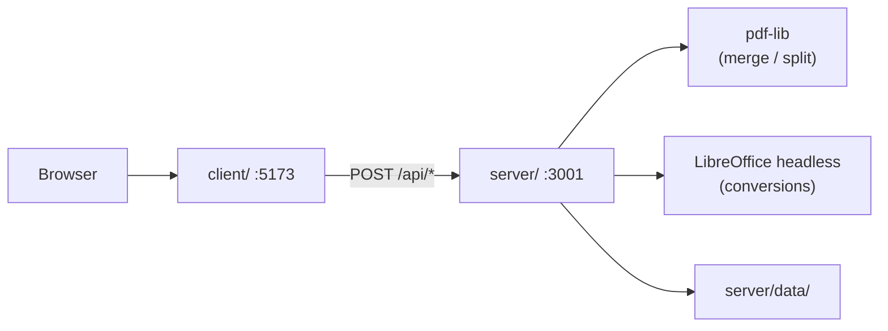

# legalHub — PDF Converter

A self-hosted document processing toolkit for legal professionals. Convert, merge, and split PDFs without sending files to third-party servers.

---

## What it solves

Legal teams often rely on online tools that upload sensitive documents (contracts, briefs, case files) to external servers. **legalHub** processes everything on the client's own infrastructure: files are uploaded, processed, and stored under the organization's security policies.

## Features

| Tool | App route | Description |
|---|---|---|
| **Merge PDF** | `/unir-pdf` | Combines multiple PDFs into one, preserving user-defined order |
| **Split PDF** | `/separar-pdf` | Splits a PDF into individual pages or by ranges (e.g. `1-3, 5, 7-9`) |
| **PDF to Word** | `/pdf-a-word` | Converts PDF to editable `.docx` |
| **Word to PDF** | `/word-a-pdf` | Converts `.docx` to PDF |
| **History** | `/historial` | List of operations performed on the server |
| **Report issue** | `/reportar-problema` | Submit bug reports with screenshots to the administrator |

All processing runs locally — no external API calls or cloud storage. Generated files and operation history are stored under `server/data/`.

---

## Architecture

Monorepo with two independent projects at the root:

```
IloveLH/
├── client/          # Frontend — React 19 + Vite + Tailwind CSS
├── server/          # Backend  — Express + TypeScript
├── docs/            # Extended documentation
└── README.md
```



| Layer | Stack | Responsibility |
|---|---|---|
| **client/** | React, Vite, Tailwind | UI, file upload, result download |
| **server/** | Express, multer, pdf-lib, archiver, LibreOffice | Processing, storage, history |

---

## Installation

**Prerequisites:** Node.js 18+, npm, and [LibreOffice](https://www.libreoffice.org/) (PDF ↔ Word conversions only).

```bash
git clone <repo-url>
cd IloveLH

# Backend
cd server
npm install
cp .env.example .env   # edit for your environment

# Frontend
cd ../client
npm install
cp .env.example .env   # optional when using the dev proxy
```

## Environment variables

#### `server/.env`

| Variable | Default | Description |
|---|---|---|
| `PORT` | `3001` | API port |
| `UPLOAD_DIR` | `uploads` | Temporary upload folder (relative to `server/`) |
| `MAX_FILE_SIZE` | `52428800` | Max upload size in bytes (50 MB) |
| `CLIENT_ORIGIN` | `http://localhost:5173,...` | CORS allowed origins (comma-separated) |
| `LIBREOFFICE_PATH` | _(auto-detect)_ | Path to `soffice`. **On Windows, use quotes if the path contains spaces** |
| `CONVERSION_TIMEOUT_MS` | `60000` | LibreOffice conversion timeout (ms) |

Windows example:

```env
LIBREOFFICE_PATH="C:\Program Files\LibreOffice\program\soffice.exe"
```

#### `client/.env`

| Variable | Default | Description |
|---|---|---|
| `VITE_API_URL` | _(empty)_ | Backend base URL. Empty = use Vite proxy in development |

## Local development

Start **two terminals**:

```bash
# Terminal 1 — API
cd server && npm run dev

# Terminal 2 — Frontend
cd client && npm run dev
```

- Frontend: `http://localhost:5173`
- Backend: `http://localhost:3001`

By default, Vite proxies `/api/*` to the backend. Set `VITE_API_URL=http://localhost:3001` to call the API directly (requires CORS).

On startup, the server checks for LibreOffice. If not found, conversion endpoints return `503` but merge and split keep working.

### Production build

```bash
cd server && npm run build && npm start
cd client && npm run build    # outputs to client/dist/
```

Serve `client/dist/` with nginx, Caddy, or similar, proxying `/api` to the backend.

## Project structure

```
client/src/
├── pages/                # One page per tool
├── components/           # Reusable UI
├── services/             # HTTP client for the backend
└── types/                # Tool configuration

server/src/
├── routes/               # Route definitions
├── controllers/          # Request / response
├── services/             # Business logic (merge, split, conversion, history)
└── middleware/           # Upload, error handling
```

## API

Base URL: `http://localhost:3001/api`

```
GET    /health
POST   /merge
POST   /split
POST   /pdf-to-word
POST   /word-to-pdf
GET    /historial
DELETE /processes/:id
POST   /reports
```

Full endpoint reference: [docs/API.md](docs/API.md)

## Troubleshooting

**Server shows LibreOffice warning but it is installed**

- Ensure `LIBREOFFICE_PATH` in `server/.env` is quoted if the path contains spaces.
- Restart the server after editing `.env`.

**Port 3001 in use (`EADDRINUSE`)**

- Stop the previous server instance or change `PORT` in `.env`.

**Frontend cannot reach the backend**

- Confirm the server is running on `:3001`.
- If using `VITE_API_URL`, verify `CLIENT_ORIGIN` includes the frontend port.

---

## License

Private project — internal use only.
