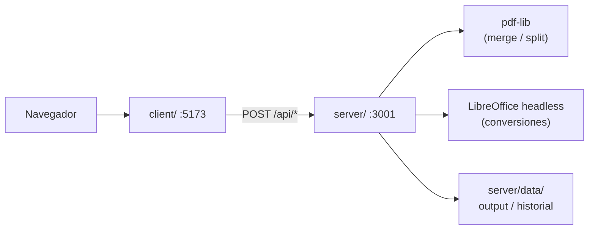

# legalHub — Conversor PDF

Herramienta self-hosted de procesamiento de documentos para profesionales del derecho. Convierte, une y separa PDFs sin enviar archivos a servidores de terceros.

---

### Qué resuelve

Los equipos legales suelen depender de herramientas online que suben documentos sensibles (contratos, escritos, expedientes) a servidores externos. **legalHub** procesa todo en la infraestructura del cliente: los archivos se suben, procesan y almacenan bajo las políticas de seguridad propias de la organización.

### Funcionalidades disponibles

| Herramienta | Ruta en la app | Descripción |
|---|---|---|
| **Unir PDF** | `/unir-pdf` | Combina varios PDFs en uno solo, respetando el orden elegido por el usuario |
| **Separar PDF** | `/separar-pdf` | Divide un PDF por páginas individuales o por rangos (ej. `1-3, 5, 7-9`) |
| **PDF a Word** | `/pdf-a-word` | Convierte PDF a `.docx` editable |
| **Word a PDF** | `/word-a-pdf` | Convierte `.docx` a PDF |
| **Historial** | `/historial` | Lista de operaciones realizadas en el servidor |
| **Reportar problema** | `/reportar-problema` | Envío de reportes con capturas al administrador |

### Privacidad y datos

- Todo el procesamiento ocurre en el servidor propio; no hay llamadas a APIs externas ni almacenamiento en la nube.
- Los resultados se guardan en `server/data/output/` (excluido de Git).
- El historial de operaciones reales se persiste en `server/data/processes.json`.
- Los archivos temporales de subida se eliminan automáticamente tras cada operación.
- Adecuado para entornos con requisitos estrictos de confidencialidad o residencia de datos.

### Flujo de usuario

1. El usuario elige una herramienta desde la landing (`/herramienta`).
2. Sube uno o más archivos desde el navegador.
3. El frontend envía los archivos al backend vía API.
4. El backend procesa, guarda el resultado y devuelve el archivo para descarga.
5. La operación queda registrada en el historial.

---

### Arquitectura

Monorepo con dos proyectos independientes en la raíz:

```
IloveLH/
├── client/          # Frontend — React 19 + Vite + Tailwind CSS
├── server/          # Backend  — Express + TypeScript
├── .gitignore
└── README.md
```



| Capa | Stack | Responsabilidad |
|---|---|---|
| **client/** | React, Vite, Tailwind, pdf-lib (solo lectura de metadatos) | UI, subida de archivos, descarga de resultados |
| **server/** | Express, multer, pdf-lib, archiver, LibreOffice | Procesamiento, almacenamiento, historial |

### Requisitos previos

- **Node.js** 18 o superior
- **npm**
- **LibreOffice** (solo para conversiones PDF ↔ Word)
  - Windows: [LibreOffice](https://www.libreoffice.org/) o `winget install TheDocumentFoundation.LibreOffice`
  - Linux: `sudo apt install libreoffice`
  - macOS: `brew install --cask libreoffice`

### Instalación

```bash
git clone <repo-url>
cd IloveLH

# Backend
cd server
npm install
cp .env.example .env   # editar según el entorno

# Frontend
cd ../client
npm install
cp .env.example .env   # opcional en desarrollo con proxy
```

### Variables de entorno

#### `server/.env`

| Variable | Default | Descripción |
|---|---|---|
| `PORT` | `3001` | Puerto del API |
| `UPLOAD_DIR` | `uploads` | Carpeta de archivos temporales (relativa a `server/`) |
| `MAX_FILE_SIZE` | `52428800` | Tamaño máximo de subida en bytes (50 MB) |
| `CLIENT_ORIGIN` | `http://localhost:5173,...` | Orígenes permitidos por CORS (separados por coma) |
| `LIBREOFFICE_PATH` | _(auto-detect)_ | Ruta al ejecutable `soffice`. **En Windows, usar comillas si hay espacios** |
| `CONVERSION_TIMEOUT_MS` | `60000` | Timeout de conversiones LibreOffice (ms) |

Ejemplo Windows:

```env
LIBREOFFICE_PATH="C:\Program Files\LibreOffice\program\soffice.exe"
```

#### `client/.env`

| Variable | Default | Descripción |
|---|---|---|
| `VITE_API_URL` | _(vacío)_ | URL base del backend. Vacío = usa proxy de Vite en desarrollo |

### Desarrollo local

Levantar **dos terminales**:

```bash
# Terminal 1 — API
cd server
npm run dev

# Terminal 2 — Frontend
cd client
npm run dev
```

- Frontend: `http://localhost:5173` (o el puerto que asigne Vite)
- Backend: `http://localhost:3001`

#### Modos de conexión frontend ↔ backend

| Modo | Config | Comportamiento |
|---|---|---|
| **Proxy** (default) | `VITE_API_URL` vacío | Vite redirige `/api/*` → `localhost:3001` |
| **Directo** | `VITE_API_URL=http://localhost:3001` | El browser llama al backend directo; requiere CORS configurado |

Al arrancar, el server verifica LibreOffice y muestra en consola:

```
LibreOffice detectado: C:\Program Files\LibreOffice\program\soffice.exe
```

Si no lo encuentra, las conversiones responden `503` pero el resto de herramientas sigue funcionando.

### Build de producción

```bash
# Backend
cd server
npm run build
npm start          # ejecuta dist/index.js

# Frontend
cd client
npm run build      # genera client/dist/
npm run preview    # preview local del build
```

Servir `client/dist/` con nginx, Caddy o similar, apuntando `/api` al backend en el puerto configurado.

### API REST

Base URL: `http://localhost:3001/api`

#### Salud

| Método | Ruta | Descripción |
|---|---|---|
| `GET` | `/health` | `{ status: "ok", timestamp: "..." }` |

#### Procesamiento de documentos

| Método | Ruta | Body (multipart) | Respuesta |
|---|---|---|---|
| `POST` | `/merge` | `files[]` — mín. 2 PDFs | PDF unido (`merged.pdf`) |
| `POST` | `/split` | `file` (PDF), `ranges` (string) | ZIP con PDFs separados |
| `POST` | `/pdf-to-word` | `file` (PDF) | DOCX convertido |
| `POST` | `/word-to-pdf` | `file` (DOCX) | PDF convertido |
| `POST` | `/upload` | `file` (PDF o DOCX) | Metadatos del archivo subido |

**Parámetro `ranges` en `/split`:**

- Por rangos: `1-3,5,7-9`
- Todas las páginas: `all`

#### Historial y reportes

| Método | Ruta | Descripción |
|---|---|---|
| `GET` | `/historial` | Lista de operaciones (reales + demo) |
| `POST` | `/processes` | Registra una operación manualmente |
| `POST` | `/reports` | Guarda un reporte de problema con capturas |

#### Ejemplos curl

```bash
# Unir PDFs
curl -X POST http://localhost:3001/api/merge \
  -F "files=@doc1.pdf" -F "files=@doc2.pdf" \
  -o merged.pdf

# Separar PDF
curl -X POST http://localhost:3001/api/split \
  -F "file=@documento.pdf" -F "ranges=1-3,5" \
  -o resultado.zip

# PDF a Word
curl -X POST http://localhost:3001/api/pdf-to-word \
  -F "file=@documento.pdf" \
  -o documento.docx

# Word a PDF
curl -X POST http://localhost:3001/api/word-to-pdf \
  -F "file=@documento.docx" \
  -o documento.pdf
```

### Estructura del backend

```
server/src/
├── index.ts              # Entry point + verificación LibreOffice
├── app.ts                # Express, CORS, middleware
├── config/env.ts         # Variables de entorno
├── routes/               # Definición de rutas
├── controllers/          # Request / response
├── services/             # Lógica de negocio
│   ├── merge.service.ts
│   ├── split.service.ts
│   ├── conversion.service.ts
│   ├── libreoffice.service.ts
│   └── process.service.ts
└── middleware/           # Upload, errores
```

### Almacenamiento de datos

| Ruta | Contenido | En Git |
|---|---|---|
| `server/uploads/` | Archivos temporales de subida | No |
| `server/data/output/{uuid}/` | Resultados de cada operación | No |
| `server/data/reports/` | Reportes de problemas | No |
| `server/data/processes.json` | Historial de operaciones reales | No |
| `server/data/historial.json` | Datos de demo para el historial | Sí |

### Estructura del frontend

```
client/src/
├── pages/                # Una página por herramienta
├── components/           # UI reutilizable (formularios, dropzone, etc.)
├── services/api.ts       # Cliente HTTP hacia el backend
├── types/tools.ts        # Configuración de herramientas
└── utils/pdf.ts          # Helpers de descarga
```

### Tecnologías por funcionalidad

| Funcionalidad | Motor |
|---|---|
| Unir PDF | pdf-lib (Node) |
| Separar PDF | pdf-lib + archiver (ZIP) |
| PDF ↔ Word | LibreOffice headless (`soffice --headless --convert-to`) |
| Subida de archivos | multer |
| Historial | JSON en disco |

### Límites y errores comunes

| Situación | Código HTTP | Mensaje |
|---|---|---|
| Archivo no es PDF/DOCX | `400` | Validación de tipo |
| Menos de 2 PDFs en merge | `400` | Mínimo de archivos |
| Rangos inválidos en split | `400` | Parseo de rangos |
| LibreOffice no instalado | `503` | Conversión no disponible |
| Conversión > 60 s | `504` | Timeout |
| Archivo > 50 MB | `400` | Límite de multer |

### Troubleshooting

**El server muestra aviso de LibreOffice pero está instalado**

- Verificar que `LIBREOFFICE_PATH` en `server/.env` esté entre comillas si la ruta tiene espacios.
- Reiniciar el server tras editar `.env`.

**Puerto 3001 en uso (`EADDRINUSE`)**

- Detener la instancia previa del server o cambiar `PORT` en `.env`.

**El frontend no llega al backend**

- Confirmar que el server está corriendo en `:3001`.
- Si usás `VITE_API_URL`, verificar que `CLIENT_ORIGIN` incluya el puerto del frontend.

---

## Licencia

Proyecto privado — uso interno.
