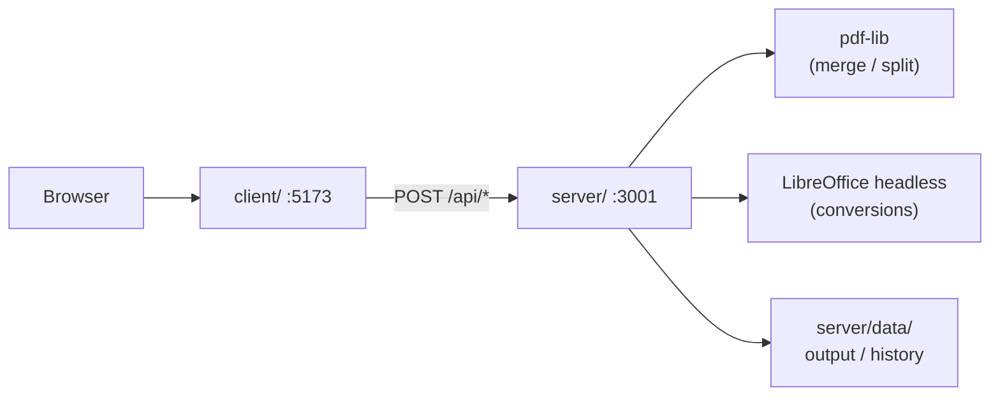

# legalHub — PDF Converter

A self-hosted document processing toolkit for legal professionals. Convert, merge, and split PDFs without sending files to third-party servers.

---

##  Product 

### What it solves

Legal teams often rely on online tools that upload sensitive documents (contracts, briefs, case files) to external servers. **legalHub** processes everything on the client's own infrastructure: files are uploaded, processed, and stored under the organization's security policies.

### Available features

| Tool | App route | Description |
|---|---|---|
| **Merge PDF** | `/unir-pdf` | Combines multiple PDFs into one, preserving user-defined order |
| **Split PDF** | `/separar-pdf` | Splits a PDF into individual pages or by ranges (e.g. `1-3, 5, 7-9`) |
| **PDF to Word** | `/pdf-a-word` | Converts PDF to editable `.docx` |
| **Word to PDF** | `/word-a-pdf` | Converts `.docx` to PDF |
| **History** | `/historial` | List of operations performed on the server |
| **Report issue** | `/reportar-problema` | Submit bug reports with screenshots to the administrator |

### Privacy and data

- All processing runs on your own server; no external API calls or cloud storage.
- Results are saved to `server/data/output/` (excluded from Git).
- Real operation history is persisted in `server/data/processes.json`.
- Temporary upload files are automatically deleted after each operation.
- Suitable for environments with strict confidentiality or data residency requirements.

### User flow

1. User selects a tool from the landing page (`/herramienta`).
2. Uploads one or more files from the browser.
3. The frontend sends files to the backend via API.
4. The backend processes, saves the result, and returns the file for download.
5. The operation is recorded in the history.

---

## Technical

### Architecture

Monorepo with two independent projects at the root:

```
IloveLH/
├── client/          # Frontend — React 19 + Vite + Tailwind CSS
├── server/          # Backend  — Express + TypeScript
├── .gitignore
└── README.md
```



| Layer | Stack | Responsibility |
|---|---|---|
| **client/** | React, Vite, Tailwind, pdf-lib (metadata only) | UI, file upload, result download |
| **server/** | Express, multer, pdf-lib, archiver, LibreOffice | Processing, storage, history |

### Prerequisites

- **Node.js** 18 or higher
- **npm**
- **LibreOffice** (PDF ↔ Word conversions only)
  - Windows: [LibreOffice](https://www.libreoffice.org/) or `winget install TheDocumentFoundation.LibreOffice`
  - Linux: `sudo apt install libreoffice`
  - macOS: `brew install --cask libreoffice`

### Installation

```bash
git clone <repo-url>
cd IloveLH

# Backend
cd server
npm install
cp .env.example .env   # edit for your environment

# Frontend
cd ../client
npm install
cp .env.example .env   # optional when using the dev proxy
```

### Environment variables

#### `server/.env`

| Variable | Default | Description |
|---|---|---|
| `PORT` | `3001` | API port |
| `UPLOAD_DIR` | `uploads` | Temporary upload folder (relative to `server/`) |
| `MAX_FILE_SIZE` | `52428800` | Max upload size in bytes (50 MB) |
| `CLIENT_ORIGIN` | `http://localhost:5173,...` | CORS allowed origins (comma-separated) |
| `LIBREOFFICE_PATH` | _(auto-detect)_ | Path to `soffice` executable. **On Windows, use quotes if the path contains spaces** |
| `CONVERSION_TIMEOUT_MS` | `60000` | LibreOffice conversion timeout (ms) |

Windows example:

```env
LIBREOFFICE_PATH="C:\Program Files\LibreOffice\program\soffice.exe"
```

#### `client/.env`

| Variable | Default | Description |
|---|---|---|
| `VITE_API_URL` | _(empty)_ | Backend base URL. Empty = use Vite proxy in development |

### Local development

Start **two terminals**:

```bash
# Terminal 1 — API
cd server
npm run dev

# Terminal 2 — Frontend
cd client
npm run dev
```

- Frontend: `http://localhost:5173` (or whichever port Vite assigns)
- Backend: `http://localhost:3001`

#### Frontend ↔ backend connection modes

| Mode | Config | Behavior |
|---|---|---|
| **Proxy** (default) | `VITE_API_URL` empty | Vite forwards `/api/*` → `localhost:3001` |
| **Direct** | `VITE_API_URL=http://localhost:3001` | Browser calls the backend directly; requires CORS |

On startup, the server checks for LibreOffice and logs:

```
LibreOffice detectado: C:\Program Files\LibreOffice\program\soffice.exe
```

If not found, conversion endpoints return `503` but all other tools keep working.

### Production build

```bash
# Backend
cd server
npm run build
npm start          # runs dist/index.js

# Frontend
cd client
npm run build      # outputs to client/dist/
npm run preview    # local preview of the build
```

Serve `client/dist/` with nginx, Caddy, or similar, proxying `/api` to the backend on the configured port.

### REST API

Base URL: `http://localhost:3001/api`

#### Health

| Method | Route | Description |
|---|---|---|
| `GET` | `/health` | `{ status: "ok", timestamp: "..." }` |

#### Document processing

| Method | Route | Body (multipart) | Response |
|---|---|---|---|
| `POST` | `/merge` | `files[]` — min. 2 PDFs | Merged PDF (`merged.pdf`) |
| `POST` | `/split` | `file` (PDF), `ranges` (string) | ZIP with split PDFs |
| `POST` | `/pdf-to-word` | `file` (PDF) | Converted DOCX |
| `POST` | `/word-to-pdf` | `file` (DOCX) | Converted PDF |
| `POST` | `/upload` | `file` (PDF or DOCX) | Uploaded file metadata |

**`ranges` parameter for `/split`:**

- By range: `1-3,5,7-9`
- All pages: `all`

#### History and reports

| Method | Route | Description |
|---|---|---|
| `GET` | `/historial` | Operation list (real + demo data) |
| `POST` | `/processes` | Manually register an operation |
| `POST` | `/reports` | Save a bug report with screenshots |

#### curl examples

```bash
# Merge PDFs
curl -X POST http://localhost:3001/api/merge \
  -F "files=@doc1.pdf" -F "files=@doc2.pdf" \
  -o merged.pdf

# Split PDF
curl -X POST http://localhost:3001/api/split \
  -F "file=@document.pdf" -F "ranges=1-3,5" \
  -o result.zip

# PDF to Word
curl -X POST http://localhost:3001/api/pdf-to-word \
  -F "file=@document.pdf" \
  -o document.docx

# Word to PDF
curl -X POST http://localhost:3001/api/word-to-pdf \
  -F "file=@document.docx" \
  -o document.pdf
```

### Backend structure

```
server/src/
├── index.ts              # Entry point + LibreOffice check
├── app.ts                # Express, CORS, middleware
├── config/env.ts         # Environment variables
├── routes/               # Route definitions
├── controllers/          # Request / response
├── services/             # Business logic
│   ├── merge.service.ts
│   ├── split.service.ts
│   ├── conversion.service.ts
│   ├── libreoffice.service.ts
│   └── process.service.ts
└── middleware/           # Upload, error handling
```

### Data storage

| Path | Contents | In Git |
|---|---|---|
| `server/uploads/` | Temporary upload files | No |
| `server/data/output/{uuid}/` | Result of each operation | No |
| `server/data/reports/` | Bug reports | No |
| `server/data/processes.json` | Real operation history | No |
| `server/data/historial.json` | Demo data for the history UI | Yes |

### Frontend structure

```
client/src/
├── pages/                # One page per tool
├── components/           # Reusable UI (forms, dropzone, etc.)
├── services/api.ts       # HTTP client for the backend
├── types/tools.ts        # Tool configuration
└── utils/pdf.ts          # Download helpers
```

### Technology by feature

| Feature | Engine |
|---|---|
| Merge PDF | pdf-lib (Node) |
| Split PDF | pdf-lib + archiver (ZIP) |
| PDF ↔ Word | LibreOffice headless (`soffice --headless --convert-to`) |
| File upload | multer |
| History | JSON on disk |

### Limits and common errors

| Situation | HTTP code | Notes |
|---|---|---|
| File is not PDF/DOCX | `400` | Type validation |
| Fewer than 2 PDFs in merge | `400` | Minimum file count |
| Invalid ranges in split | `400` | Range parsing |
| LibreOffice not installed | `503` | Conversion unavailable |
| Conversion > 60 s | `504` | Timeout |
| File > 50 MB | `400` | multer limit |

### Troubleshooting

**Server shows LibreOffice warning but it is installed**

- Ensure `LIBREOFFICE_PATH` in `server/.env` is quoted if the path contains spaces.
- Restart the server after editing `.env`.

**Port 3001 in use (`EADDRINUSE`)**

- Stop the previous server instance or change `PORT` in `.env`.

**Frontend cannot reach the backend**

- Confirm the server is running on `:3001`.
- If using `VITE_API_URL`, verify `CLIENT_ORIGIN` includes the frontend port.

---

## License

Private project — internal use only.
